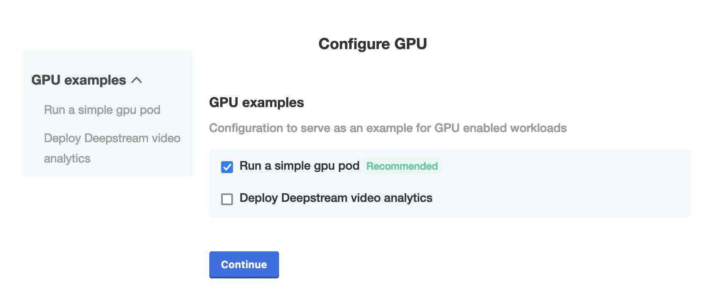

# How to run GPU workloads on a k8s cluster with kURL

## Introduction
Sometimes your Kubernetes application requires the availability of GPU enabled nodes to run certain workloads.
This is a typical requirement for applications that are using certain levels of AI or Machine Learning algorithms.
When using [kURL](https://kurl.sh) for an on-prem kubernetes installation, it is possible to enable GPU support with some minor changes in the kURL spec.
This blog post will guide you through the different steps needed to enable GPU support.

## Tutorial

### Create a GPU enabled compute instance

For example, in GCE you can easily create a GPU enable VM using the following command:

Tested on a GCE instance of type `n1-standard-8` using a `nvidia-tesla-t4` GPU and 80GB disk.

```
export IMAGE_PROJECT=ubuntu-os-cloud
export IMAGE_FAMILY=ubuntu-2204-lts
export MACHINE_TYPE=n1-standard-8
export ZONE=us-west2-b
gcloud compute instances create $INSTANCE --boot-disk-size=80GB --boot-disk-type=pd-ssd --image-project=$IMAGE_PROJECT \
                                          --image-family=$IMAGE_FAMILY --machine-type=$MACHINE_TYPE \
                                          --zone $ZONE \
                                          --accelerator=count=1,type=nvidia-tesla-t4 \
                                          --maintenance-policy=TERMINATE
```

### Install Nvidia drivers

As a first step, once the GKE instance has started, we will need to install the nvidia drivers to be able to make use of the `nvidia-tesla-4`. Login into the instance using SSH and install the Nvidia cuda drivers:

1. Add linux headers: 
   ```bash
   sudo apt-get install linux-headers-$(uname -r)
   ```
2. Capture distribution: 
   ```bash
   distribution=$(. /etc/os-release;echo $ID$VERSION_ID | sed -e 's/\.//g') \
   && wget https://developer.download.nvidia.com/compute/cuda/repos/$distribution/x86_64/cuda-$distribution.pin \
   && sudo mv cuda-$distribution.pin /etc/apt/preferences.d/cuda-repository-pin-600
   ```
3. Add gpg keys: 
   ```bash
   sudo apt-key adv --fetch-keys http://developer.download.nvidia.com/compute/cuda/repos/$distribution/x86_64/3bf863cc.pub  \
   && echo "deb http://developer.download.nvidia.com/compute/cuda/repos/$distribution/x86_64 /" | sudo tee /etc/apt/sources.list.d/cuda.list
   ```
4. Install cuda drivers: 
   ```bash
   sudo apt-get update \
   && sudo apt-get -y install cuda-drivers
   ```

### Install Nvidia Container runtime

Once the drivers are installed, we need to make sure our container runtime for k8s can also make use of the GPU. This is achieved by installing the Nvidia container runtime. On the instance execute the commands below:

5. Capture distribution: 
   ```bash
   distribution=$(. /etc/os-release;echo $ID$VERSION_ID) \
   && curl -s -L https://nvidia.github.io/nvidia-docker/gpgkey | sudo apt-key add - \
   && curl -s -L https://nvidia.github.io/nvidia-docker/$distribution/nvidia-docker.list | sudo tee /etc/apt/sources.list.d/nvidia-docker.list
   ```
6. Install nvidia-container-runtime: 
   ```bash
   sudo apt-get update \
   && sudo apt-get install -y nvidia-container-runtime
   ```

### Install kURL

Now that we have the GPU drivers and the nvidia container runtime installed, we can install kubernetes using the [kURL project](https://kurl.sh). By default kURL will make use of the `containerd` runtime. However, there is a way to path the containerd configuration and make use of the nvidia container runtime if needed. 
The kURL specification below is an example of how to patch containerd, and make use of the nvidia runtime where possible:

  ```yaml
  apiVersion: cluster.kurl.sh/v1beta1
  kind: Installer
  metadata:
    name: "gpu"
  spec:
    containerd:
      version: 1.5.x
      tomlConfig: |
        [plugins]
          [plugins."io.containerd.grpc.v1.cri"]
            [plugins."io.containerd.grpc.v1.cri".containerd]
              default_runtime_name = "nvidia"
              [plugins."io.containerd.grpc.v1.cri".containerd.runtimes]
                [plugins."io.containerd.grpc.v1.cri".containerd.runtimes.nvidia]
                  privileged_without_host_devices = false
                  runtime_engine = ""
                  runtime_root = ""
                  runtime_type = "io.containerd.runc.v1"
        [plugins."io.containerd.grpc.v1.cri".containerd.runtimes.nvidia.options]
          BinaryName = "/usr/bin/nvidia-container-runtime"
          SystemdCgroup = true
    ekco:
      version: latest
    kotsadm:
      version: latest
      disableS3: true
    kubernetes:
      version: 1.23.x
    longhorn:
      version: 1.3.x
    registry:
      version: 2.8.x
    weave:
      version: 2.6.x
  ```

If you want to install kURL with the patched config, you can use the below installer. This will take about 10 minutes to bootstrap the kubernetes node.

7. kURL install with `config.toml` patch:
   ```bash
   curl -sSL https://kurl.sh/kurl-gpu | sudo bash
   ```

When the installation is complete you'll see output like below:


### Deploy a GPU App

Next we'll deploy some GPU Application. In order to do so, we need the nvidia-device-plugin. This is a Helm chart, so for convenience, we've package everything as a Replicated Application ;-)

Browse to the `Kotsadm` endpoint shown in your `kURL` output, and accept the self signed security certificate. Once asked to login, copy the password from the `kURL` output and login.


Once you're logged in, it will ask for a license file. You can use the [license](./gpu.yaml) from this blogpost.


Once the license is uploaded, it will ask which test application should be deployed. You can go with the defaults for now. We'll deploy the Video Analytics app later.



Preflight checks will ensure that the environment we deploy into, will meet the requirements.


If everything looks ok, press continue, and the first pod requiring the gpu should be deployed. You can check by going to Troubleshoot and generating a support bundle.


Once finished, you should see an Analyzer tile showing `Yes, GPU workloads are working`.


### Deploy Deepstream

Now that we now the GPU is working, let's deploy a more cool app. The [Deepstream Video Analytics](https://catalog.ngc.nvidia.com/orgs/nvidia/helm-charts/video-analytics-demo) App.

Go in the Application installer to `Config` and Uncheck `Run a simple gpu pod` and check `Deploy deepstream video analytics`. This will generate a new version. Wait for the preflights to be succesfull, and hit deploy.


If you go to the `Dashboard`, you can click on `Open deepstream`. It will open a new webpage, and video analytics of a traffic stream will start to happen. (You might have to disable your add blocker).


### Add k8slove

As a last step, go back to the `config` screen, and check the box to add some k8s love. 


Deploy the new version, and once everything is properly running, you can click on `Open deepstream` again. Have fun!


## Additional info

+ [Nvidia docs](https://docs.nvidia.com/datacenter/cloud-native/kubernetes/install-k8s.html#install-nvidia-container-toolkit-nvidia-docker2)
+ [kURL containerd add on](https://kurl.sh/docs/add-ons/containerd)
+ [rtsp-simple-server](https://github.com/aler9/rtsp-simple-server)
